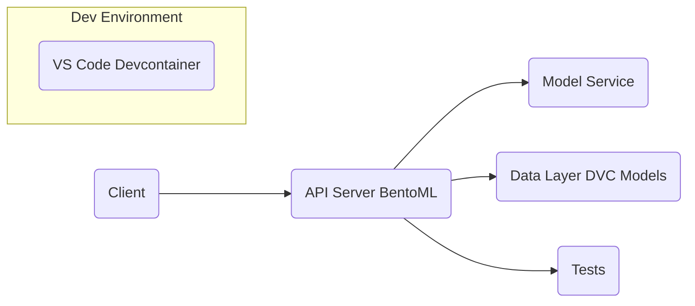
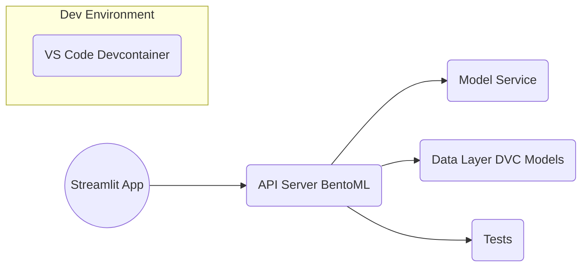
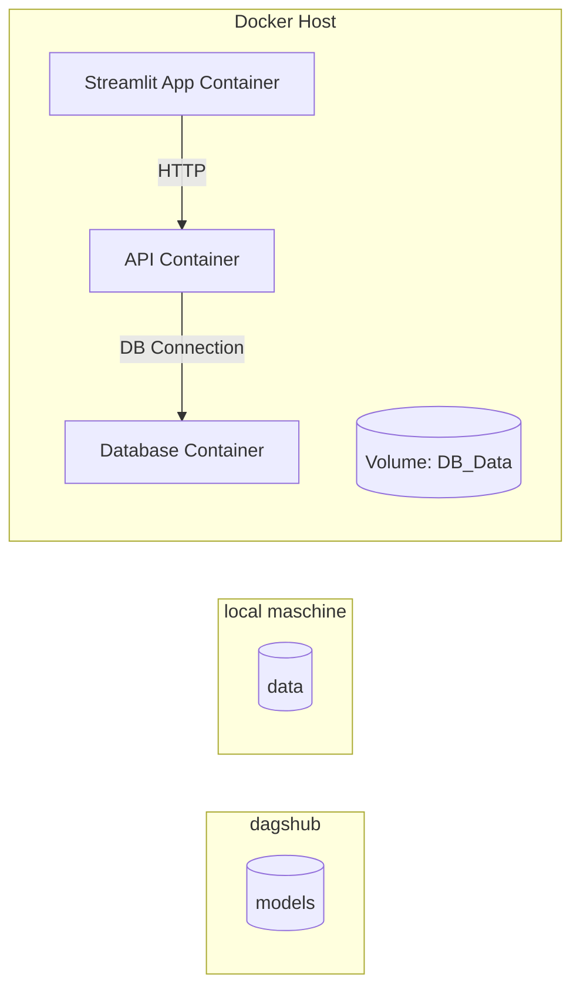

MovieRecomm - MLOPS Project

# Project Name

## Overview
This project is a data science / ML service built with BentoML, featuring containerization via Docker and development environment setup via VS Code Devcontainer. It includes automated tests and data version control with DVC.

## Features
- BentoML service for model serving
- Docker Compose for container orchestration
- VS Code Devcontainer for easy development setup
- Data version control using DVC
- Automated testing with pytest
- Example data and pre-trained models included

## Installation

### Prerequisites
- Docker & Docker Compose
- VS Code with Remote - Containers extension (optional)
- Python 3.8+ (if running locally without Docker)

### Provide the .env information
In dummy.env add your personal information for dagshub (user and token). These information will be put
into the .env file, providing the service with information regarding the location of the models.
Notes
> Note: All services read environment variables from the root .env.
> * For team work: Every developer needs their own DagsHub token in their local .env.
> * Never share .env and .dvc/config.local with secrets in public repos.
> * You can also add you tmdb api key to get the covers of recommanded movies.

### Setup using Devcontainer (recommended) - only for development
1. Open the project folder in VS Code.
2. When prompted, reopen in container.
3. This will build and start the devcontainer with all dependencies installed.

### Setup using Docker Compose
Run the start script which generates the .env and internally executes the Docker Compose command:
```bash
./start.sh
```

### Setup local Python environment

**Linux/macOS:**
```bash
python3 -m venv .venv
source .venv/bin/activate
pip install -r requirements.txt
```

**Windows:**
```bash
python -m venv .venv
.\.venv\Scripts\Activate.ps1
pip install -r requirements.txt
```

## Usage

### Start the service
Use the start script to launch the service locally (runs `docker-compose up --build`):
```bash
./start.sh
```

### Access API
After starting, the API will be accessible at `http://localhost:5000` (default port).
<!-- Other ports that might be interesting are:
* Airflow:      `http://localhost:8080`
* Streamlit:    `http://localhost:8501`
> Note: user and password for all services is "admin". -->

### Run tests
Run all tests with pytest:
```bash
pytest tests/
```

## Architecture Overview





---


    ├── LICENSE
    ├── README.md          <- The top-level README for developers using this project.
    ├── data
    │   ├── best_model_path<- path inside the container to the best performing model
    │   ├── processed      <- The final, canonical data sets for modeling.
    │   └── raw            <- The original, immutable data dump.
    │
    ├── airflow
    │   ├── dags                        <- path inside the container to the best performing model
    │   ├── logs                        <- The final, canonical data sets for modeling.
    │   ├── plugins                     <- The final, canonical data sets for modeling.
    │   ├── airflow.cfg                 <- The final, canonical data sets for modeling.
    │   ├── airflow.db                  <- The final, canonical data sets for modeling.
    │   ├── Dockerfile.airflow          <- The final, canonical data sets for modeling.
    │   ├── requirements.airflow.txt    <- The final, canonical data sets for modeling.
    │   └── webserver_config.py
    │
    ├── models             <- Trained and serialized models, model predictions, or model summaries
    │
    ├── notebooks          <- Jupyter notebooks. Naming convention is a number (for ordering),
    │                         the creator's initials, and a short `-` delimited description, e.g.
    │                         `1.0-jqp-initial-data-exploration`.
    │
    ├── references         <- Data dictionaries, manuals, and all other explanatory materials.
    │
    ├── reports            <- Generated analysis as HTML, PDF, LaTeX, etc.
    │   └── figures        <- Generated graphics and figures to be used in reporting
    │
    ├── requirements.txt   <- The requirements file for reproducing the analysis environment
    │
    ├── src                <- Source code for use in this project.
    │   ├── __init__.py    <- Makes src a Python module
    │   │
    │   ├── data           <- Scripts to download or generate data
    │   │   ├── check_structure.py    
    │   │   ├── import_raw_data.py 
    │   │   └── make_dataset.py
    │   │
    │   ├── features       <- Scripts to turn raw data into features for modeling
    │   │   └── build_features.py
    │   │
    │   ├── models         <- Scripts to train models and then use trained models to make
    │   │   │                 predictions
    │   │   ├── predict_model.py
    │   │   └── train_model.py
    │   │
    │   ├── visualization  <- Scripts to create exploratory and results oriented visualizations
    │   │   └── visualize.py
    │   └── config         <- Describe the parameters used in train_model.py and predict_model.py

--------


## Steps to Execute the Project

### 1- run the start.sh script

    ```bash
    ./start.sh
    ```

### 2- Proceed to the relating web resources:

    Streamlit: http://localhost:8501/
    Airflow Web UI: http://localhost:8080/

The rest is self-explaining.

---

### 4. Access the Services

Once the containers are running, access the services:

- **Streamlit App:**  
  URL: [http://localhost:8501](http://localhost:8501)  
  Login: `admin / admin`

- **Airflow Web UI:**  
  URL: [http://localhost:8080](http://localhost:8080)  
  Login: `admin / admin`

---

### 5. Verify Airflow DAGs

1. Open the Airflow Web UI.
2. Check if the DAGs (e.g., `movie_recommendation_pipeline`) are listed.
3. Trigger the DAG manually if needed.

---

### Optional: Run Python Scripts Locally

If you want to test the Python scripts manually (without Airflow), follow these steps:

#### Create Virtual Environment

```bash
python -m venv my_env
```

Activate the virtual environment:

```bash
source my_env/bin/activate  # For Linux/MacOS
./my_env/Scripts/activate   # For Windows
```

#### Install Dependencies

```bash
pip install -r requirements.txt
```

#### Run Scripts

Execute the Python scripts step-by-step:

```bash
python src/data/import_raw_data.py
python src/data/make_dataset.py
python src/features/build_features.py
python src/models/train_model.py
python src/models/predict_model.py
```

---

<p><small>Project based on the <a target="_blank" href="https://drivendata.github.io/cookiecutter-data-science/">cookiecutter data science project template</a>. #cookiecutterdatascience</small></p>
