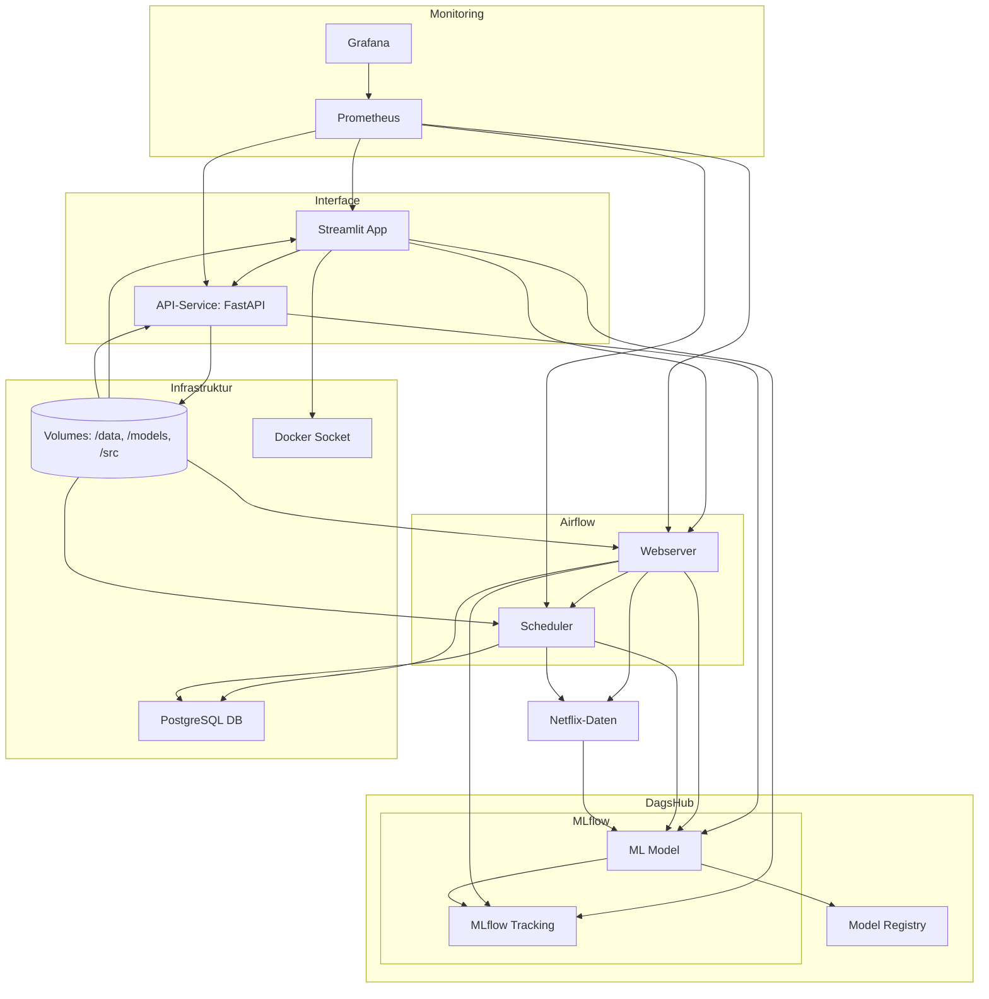

# MovieRecomm - MLOPS Project

## Overview
MovieRecomm is a full-stack machine learning project for movie recommendation, taking a practical approach from Jupyter notebook prototyping all the way to containerized, production-grade MLOps.
The project’s core: Build reliable, personalized movie recommendations, automate ML pipelines, and make the system easily reproducible for any team member.

The project began with fast experimentation and model-building in Jupyter notebooks, focusing on understanding the data, user behavior, and the most effective recommendation strategies. Special care was taken to construct train/test splits for each individual user—a non-trivial problem in real-world recommendation systems. We also integrated genre-based modeling to combine collaborative and content-based filtering.

Once initial models delivered convincing results, the system was refactored into a modern, modular architecture:

* All services (API, Streamlit app, Airflow, database, monitoring) run in Docker containers managed by Docker Compose.

* Orchestration is handled by Apache Airflow, automating data pipelines from ingestion to retraining.

* Data and model artifacts are versioned using DVC to guarantee full reproducibility.

* A VS Code Devcontainer is provided for easy, consistent onboarding and development.

* Automated tests and continuous integration are in place for reliability and fast iteration.

* Monitoring with Prometheus and Grafana ensures insight into both system health and model performance.

### In short:
MovieRecomm demonstrates how to take a data-driven prototype and turn it into a robust, maintainable machine learning product—ready for real-world usage and further scaling.

## Features
- Docker Compose for container orchestration
- VS Code Devcontainer for easy development setup
- Data version control using DVC
- Automated testing with pytest
- Example data and pre-trained models included
- Airflow run ning the pipelines
- Streamlit for user access and visualisation

## Methodology
This project followed a typical data science and MLOps workflow, starting with rapid prototyping in Jupyter Notebooks and evolving into a production-ready, containerized system.

### Prototyping and Exploratory Data Analysis

* The project started with exploratory analysis and modeling in Jupyter Notebooks.

* Data wrangling, visualization, feature engineering, and initial model selection were performed interactively to quickly iterate on ideas and gain insights.

### Custom Train/Test Split per User

* Unlike standard ML projects, splitting the data required special handling.

* For every user in the dataset, a dedicated train and test set was created to ensure fair evaluation and avoid data leakage between train/test phases.

* This approach guarantees that each user’s recommendations are tested on unseen movies, leading to a more realistic and robust model evaluation.

### Genre-Based Modeling

* In addition to user-based recommendations, the system also generates predictions based on movie genres.

* This dual-approach allows for hybrid recommendations, combining collaborative filtering with content-based filtering.

### Transition to Production Architecture

* Once the notebook-based models reached satisfactory results, the project moved to a modular, containerized architecture.

* All components (API, Streamlit app, Airflow pipelines, database, monitoring stack) were migrated into Docker containers for consistency and reproducibility.

### Pipeline Orchestration and Automation

* Apache Airflow orchestrates the training, evaluation, and retraining pipelines.

* Each step (data processing, model training, validation, reporting) is automated, ensuring a reproducible workflow from raw data to final predictions.

### Data and Model Versioning

* All datasets, model artifacts, and experiment results are versioned using DVC (Data Version Control), supporting experiment tracking and rollbacks.

* Environment variables and secrets are kept out of version control to protect sensitive data.

### Testing, CI/CD and Development Workflow

* Automated tests (pytest) and GitHub Actions CI/CD ensure code quality and fast feedback on pull requests.

* The project supports fast onboarding with a VS Code Devcontainer and a unified Docker Compose setup.

### Monitoring and Visualization

* Model performance and system health are continuously monitored using Prometheus and visualized with Grafana dashboards.

* Drift detection, metrics, and system reports are integrated into the monitoring stack.

By combining rapid notebook-based experimentation with robust MLOps practices, this project delivers a scalable, maintainable, and production-ready movie recommendation system.

## Installation

### Prerequisites
- Docker & Docker Compose
- VS Code with Remote - Containers extension (optional)
- Python 3.8+ (if running locally without Docker)

### Provide the .env information
In dummy.env add your personal information for dagshub (user and token). These information will be put
into the .env file, providing the service with information regarding the location of the models.
Notes
> Note: All services read environment variables from the root .env.
> * For team work: Every developer needs their own DagsHub token in their local .env.
> * Never share .env and .dvc/config.local with secrets in public repos.
> * You can also add you tmdb api key to get the covers of recommanded movies.

### Setup using Devcontainer (recommended) - only for development
1. Open the project folder in VS Code.
2. When prompted, reopen in container.
3. This will build and start the devcontainer with all dependencies installed.

### Setup using Docker Compose
Run the start script which generates the .env and internally executes the Docker Compose command:
```bash
./start.sh
```

### Setup local Python environment

**Linux/macOS:**
```bash
python3 -m venv .venv
source .venv/bin/activate
pip install -r requirements.txt
```

**Windows:**
```bash
python -m venv .venv
.\.venv\Scripts\Activate.ps1
pip install -r requirements.txt
```

#### Install Dependencies

```bash
pip install -r requirements.txt
```

## Usage

### Start the service
Use the start script to launch the service locally (runs `docker-compose up --build`):
```bash
./start.sh
```

### Access API
After starting, the API will be accessible at `http://localhost:5000` (default port).
Other ports that might be interesting are:
* Airflow:      `http://localhost:8080`
* Streamlit:    `http://localhost:8501`
> Note: user and password for all services is "admin".
> import reports/movie_recommender_grafana_dashboard.json into grafana dashboard !!!
### Run tests
Run all tests with pytest:
```bash
pytest tests/
```

## Architecture Overview



---


    ├── LICENSE
    ├── README.md          <- The top-level README for developers using this project.
    ├── .devcontainer/             # VS Code Umgebung
    ├── .github/                   # GitHub Actions Workflows
    ├── data
    │   ├── monitoring     <- Data from third party sources.
    │   ├── processed      <- The final, canonical data sets for modeling.
    │   └── raw            <- The original, immutable data dump.
    │
    │
    ├── models             <- Trained and serialized models, model predictions, or model summaries (local)
    │
    ├── references         <- Data dictionaries, manuals, and all other explanatory materials.
    │
    ├── reports            <- HTML-Reports, Metriken, Prometheus Dumps
    │   └── figures        <- Generated graphics and figures to be used in reporting
    │
    ├── requirements.txt   <- The requirements file for reproducing the analysis environment, e.g.
    │                         generated with `pip freeze > requirements.txt`
    │
    ├── src/                       # Source-code-
    │   ├── airflow/
    │   │   ├── Dockerfile.airflow
    │   │   ├── requirements.airflow.txt
    │   │   ├── webserver_config.py
    │   │   └── dags/
    │   │       ├── bento_api_pipeline.py
    │   │       ├── drift_monitoring_dag.py
    │   │       └── train_deep_model_dag.py
    │   ├── api_service/
    │   │   ├── Dockerfile.API
    │   │   ├── main.py
    │   │   ├── metrics.py
    │   │   ├── pw.py
    │   │   ├── recommend.py
    │   │   ├── trainer.py
    │   │   ├── requirements.api.txt
    │   │   └── users.json
    │   ├── Bento_service/
    │   │   ├── bento_service.py
    │   │   ├── Dockerfile.Bento
    │   │   ├── metrics.py
    │   │   └── requirements.bento.txt
    │   ├── monitoring/
    │   │   ├── analyze_drift.py
    │   │   ├── analyze_drift_requests.py
    │   │   ├── generate_drift_report_extended.py
    │   │   ├── generate_embedding.py
    │   │   └── plot_precision_history.py
    │   ├── movie/
    │   │   ├── data/
    │   │   │   ├── check_structure.py
    │   │   │   ├── import_raw_data.py
    │   │   │   └── make_dataset.py
    │   │   ├── features/
    │   │   │   └── build_features.py
    │   │   ├── models/
    │   │   │   ├── predict_best_model.py
    │   │   │   ├── predict_model.py
    │   │   │   ├── train_hybrid_deep_model.py
    │   │   │   ├── train_model.py
    │   │   │   └── validate_model.py
    │   │   └── visualization/
    │   │       └── visualize.py
    │   └── streamlit_app/
    │       ├── app.py
    │       ├── auth.py
    │       ├── recommender.py
    │       ├── training.py
    │       ├── requirements.streamlit.txt
    │       └── Dockerfile.streamlit
    ├── tests/                     # Unit Tests
    ├── docker-compose.yml         # Multi-Container Setup
    ├── setup.py                   # Python Paket
    ├── requirements.txt           # installers for dev container
    ├── .env                       # Lokale Variablen (nicht tracken)

--------


## Steps to Execute the Project

### 1- run the start.sh script

    ```bash
    ./start.sh
    ```

### 2- Proceed to the relating web resources:

Once the containers are running, access the services:

- **Streamlit App:**  
  URL: [http://localhost:8501](http://localhost:8501)  
  Login: `admin / admin`

- **Airflow Web UI:**  
  URL: [http://localhost:8080](http://localhost:8080)  
  Login: `admin / admin`

---

### 3- Verify Airflow DAGs

1. Open the Airflow Web UI.
2. Check if the DAGs (e.g., `movie_recommendation_pipeline`) are listed.
3. Trigger the DAG manually if needed.

---

### Optional: Run Python Scripts Locally

If you want to test the Python scripts manually (without Airflow), follow these steps:

#### Run Scripts

Execute the Python scripts step-by-step:

```bash
python src/data/import_raw_data.py
python src/data/make_dataset.py
python src/features/build_features.py
python src/models/train_model.py
python src/models/predict_model.py
```

---

<p><small>Project based on the <a target="_blank" href="https://drivendata.github.io/cookiecutter-data-science/">cookiecutter data science project template</a>. #cookiecutterdatascience</small></p>
